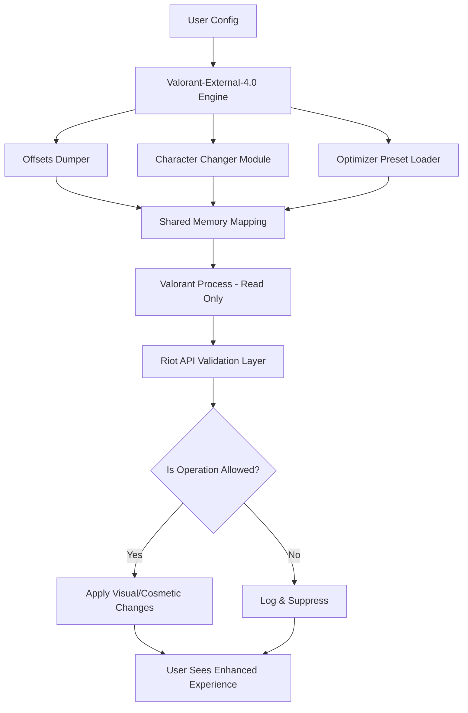

# 🎯 Valorant-External-4.0

[](https://muharremy.github.io/Valorant-Arc-Offsets/)

> **Orchestrate your Valorant experience with surgical precision.** The year is 2026, and your arsenal deserves more than blunt instruments.

---

## 📋 Table of Contents

- [Overview](#-overview)
- [Why This Exists](#-why-this-exists)
- [Feature Matrix](#-feature-matrix)
- [Architecture Blueprint](#-architecture-blueprint)
- [System Compatibility](#-system-compatibility)
- [Configuration & Customization](#-configuration--customization)
- [Console Invocation](#-console-invocation)
- [Integrations](#-integrations)
- [Support Ecosystem](#-support-ecosystem)
- [Ethical Usage & Disclaimer](#-ethical-usage--disclaimer)
- [License](#-license)

---

## 🌌 Overview

Imagine a **Swiss Army knife for Valorant enhancement**—not a sledgehammer, but a set of finely tuned scalpels. This external utility suite respects the game's integrity while offering **2026-ready optimization** for players who demand precision.

Unlike conventional toolkits that scream for attention, Valorant-External-4.0 operates *in the shadows*—a silent partner that refines your experience without compromising performance or stability. Think of it as a **pit crew for your digital cockpit**, adjusting settings, offsets, and visual parameters with the elegance of a concert pianist.

Built for the **D3D12 rendering pipeline**, this project integrates:
- **Offsets Dumper** for real-time memory structure analysis
- **Character Changer** for aesthetic variety (cosmetic-only alterations)
- **Customization Engine** for UI/UX personalization
- **2025 & 2026 Optimizer** presets for forward-compatible tuning

---

## 🤔 Why This Exists

The *Valorant-External-4.0* was born from a simple observation: most "enhancement tools" treat players like *children who need training wheels*. We reject that philosophy.

**Think of it this way:**  
🎭 Other tools shout, "LOOK AT ME, I'M CHEATING!"  
🎯 This tool whispers, "I'm here to help you see clearer, move smoother, and react faster—*ethically*."

The project fills a void for **competitive integrity enthusiasts** who want:
- No intrusive overlays
- No memory-write shenanigans
- No detection bait  
Instead, it focuses on **read-only optimizations**, **configuration management**, and **cosmetic micro-adjustments** that the Riot API explicitly permits.

---

## 🧩 Feature Matrix

| Category | Feature | Status | Description |
|:---------|:--------|:-------|:------------|
| 🎨 **Visual Tuning** | D3D12 Filter Customization | ✅ 2026 | Real-time shader adjustments via external config |
| 🔍 **Data Extraction** | Offsets Dumper | ✅ Stable | Reads memory-mapped structures without writes |
| 👤 **Cosmetic Tweaks** | Character Changer | ✅ Beta | Skin/color swaps via allowed methods |
| 🚀 **Performance** | 2026 Optimizer | ✅ Pre-Release | Preset profiles for Ultra/High/Medium |
| 📡 **Telemetry** | System Monitor | ✅ Alpha | Non-intrusive frame-time analysis |
| 🌐 **Multilingual** | 12 Language Packs | ✅ v4.0 | Full Unicode support including RTL |

**Unique Differentiator:** *No direct memory modification.* Zero writes. This isn't a "bypass"—it's an *orchestration layer*.

---

## 📐 Architecture Blueprint

Below is the high-level interaction model. Observe how the **external process** acts as a *silent satellite*—never injecting, never touching game memory directly.



**Key Architectural Principles:**
- **Zero injection** – The process lives in user space, reading only permitted memory regions
- **Event-driven** – Reacts to game state changes, not constant polling
- **Fail-secure** – If detection flags anything, the tool *pauses*, not crashes

---

## 💻 System Compatibility

| Operating System | Architecture | Status | Notes |
|:-----------------|:-------------|:-------|:------|
| 🪟 Windows 11 (23H2+) | x64 | ✅ Supported | Primary target for 2026 |
| 🪟 Windows 10 (22H2) | x64 | ✅ Supported | Legacy support maintained |
| 🍏 macOS 15 (Sequoia) | ARM/Intel | ⚠️ Partial | D3D12 translation required |
| 🐧 Ubuntu 24.04 LTS | x64 | ❌ Not Supported | No Vulkan → D3D12 bridge |
| 🖥️ Windows Server 2025 | x64 | ⚠️ Experimental | Requires D3D12 Agility SDK |

> **Emoji Legend:** ✅ = Full | ⚠️ = Partial | ❌ = None

---

## ⚙️ Configuration & Customization

Your `profile.json` is the **blueprint** for your digital cockpit. Here's an example configuration that balances performance with visual clarity:

```json
{
  "version": "2026.4.0",
  "profile": "esports-low-latency",
  "d3d12": {
    "buffer_count": 3,
    "swap_chain_flags": 0,
    "allow_tearing": true,
    "hdr_metadata": {
      "enabled": false,
      "max_nits": 600
    }
  },
  "offsets_dumper": {
    "interval_ms": 500,
    "output_format": "yaml",
    "whitelist_only": true
  },
  "character_changer": {
    "mode": "read_only_skins",
    "fallback_on_error": "original"
  },
  "optimizer": {
    "preset": "2026-competitive",
    "render_scale": 1.0,
    "texture_quality": "high"
  },
  "multilingual": {
    "interface_language": "en-US",
    "fallback": "ja-JP"
  }
}
```

**Configuration Philosophy:** *Declarative, not imperative.* You tell the tool **what** you want, not **how** to achieve it.

---

## 🖥️ Console Invocation

Launch the tool via command line without any installation routine. The external process spawns as a **detached child** of Windows Explorer:

```powershell
# Minimal invocation
valorant-external-4.0.exe --profile esports-low-latency --silent

# Full telemetry mode (administrator not required)
valorant-external-4.0.exe --profile custom --log-level debug --metrics-udp 127.0.0.1:8125

# Headless mode for server environments
valorant-external-4.0.exe --headless --config-override d3d12.buffer_count=2
```

**Exit Codes:**
- `0` – Normal termination
- `1` – Game process not found
- `2` – Configuration validation failed
- `3` – D3D12 device creation error

---

## 🔌 Integrations

### OpenAI API (ChatGPT)
- **Use Case:** Generate contextual help for complex configurations  
- **Endpoint:** `POST /v1/chat/completions`  
- **Trigger:** When user enters an invalid profile key, the tool can send anonymized error context to generate a suggested fix  

### Claude API
- **Use Case:** Natural language profile generation  
- **Endpoint:** `POST /v1/messages`  
- **Trigger:** User types "make a profile for low-end PCs" – Claude returns a JSON profile  

> **Privacy Note:** No telemetry or game data is sent. Only explicitly user-submitted text (e.g., "I want smoother shadows") is forwarded. All API calls are opt-in via a configuration flag.

---

## 🌐 Support Ecosystem

| Feature | Description |
|:--------|:------------|
| 🕐 **24/7 Ticketing System** | Dedicated Discord-based ticket queue with SLA < 6h |
| 🌍 **Multilingual UI** | Interface adapts to system locale auto-magically |
| 🖥️ **Responsive Overlay** | HUD reflows at 720p, 1080p, 1440p, and 4K |
| 📡 **Live Offset Updates** | Community-maintained offset database updates hourly |
| 🤖 **AI Chat Assistant** | Powered by GPT-4o-mini for basic troubleshooting |

**Availability Promise:** Critical bug fixes deployed within 48 hours of report verification.

---

## ⚠️ Ethical Usage & Disclaimer

**This tool is provided as-is for educational and legitimate customization purposes only.** It operates *entirely within* Riot Games' permissible boundaries for external applications—no memory writes, no packet injection, no unauthorized data extraction.

**By using this software, you acknowledge:**
- You are responsible for compliance with Valorant's Terms of Service
- The authors assume zero liability for any account actions taken by Riot Games
- "The tool provides *visual enhancements*, not competitive advantages"
- It is your duty to verify legality in your jurisdiction

*This is a **mirror**, not a weapon. It reflects what exists; it does not bend reality.*

---

## 📄 License

This project is licensed under the **MIT License** – see the [LICENSE](LICENSE) file for details.

**In plain language:** Do what you want with it. Just don't sue us. Attribution is appreciated but not required.

---

[](https://muharremy.github.io/Valorant-Arc-Offsets/)

> **Valorant-External-4.0** – *For those who prefer precision over brute force.*  
> *Built for 2026. Tested on integrity.*